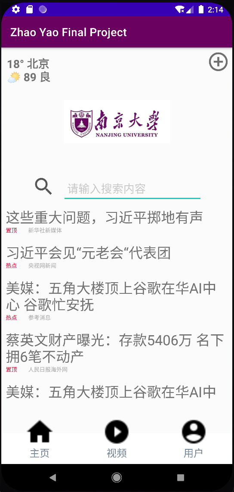
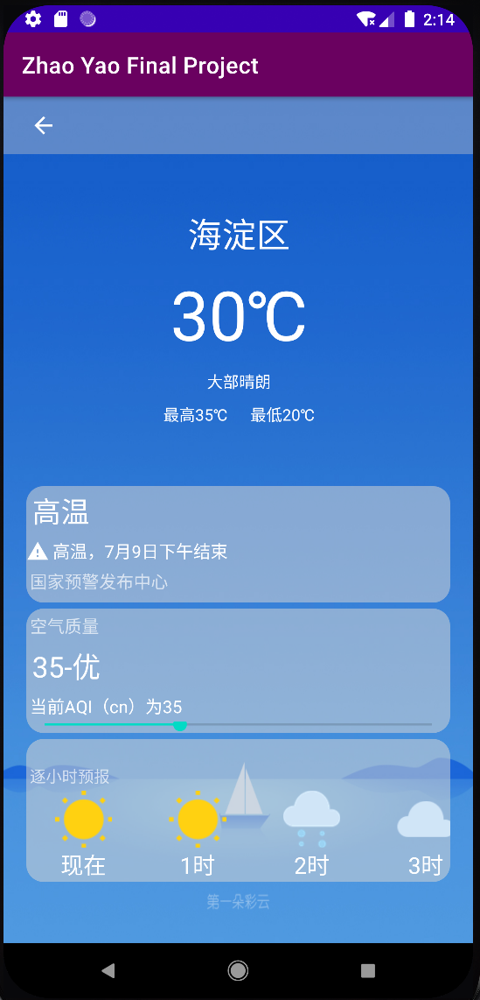
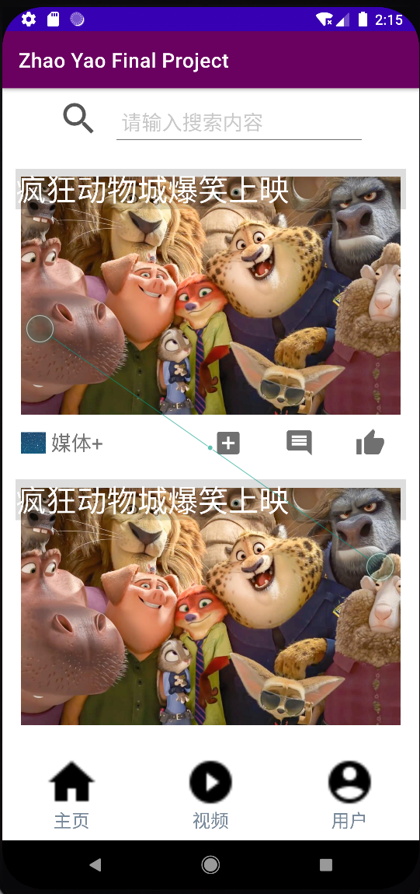
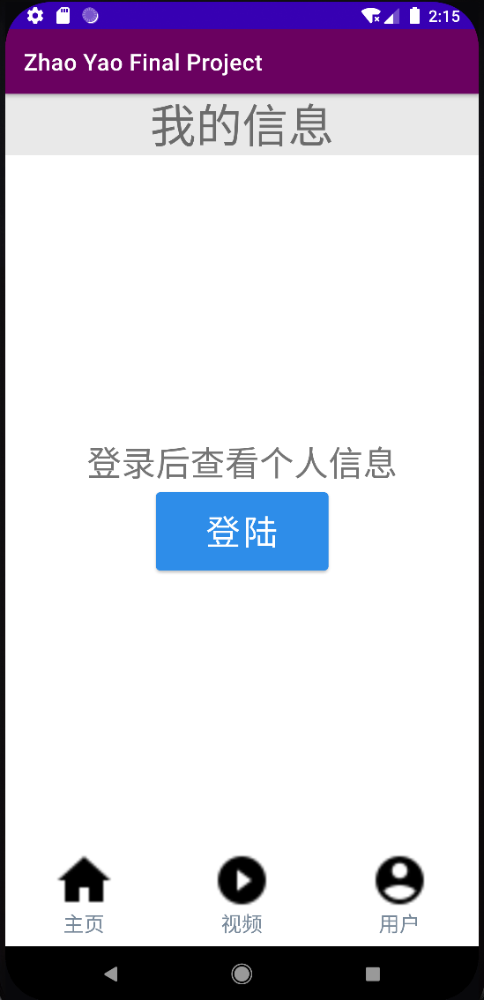
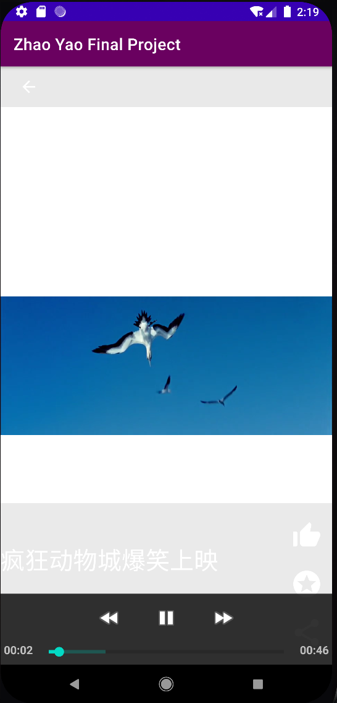
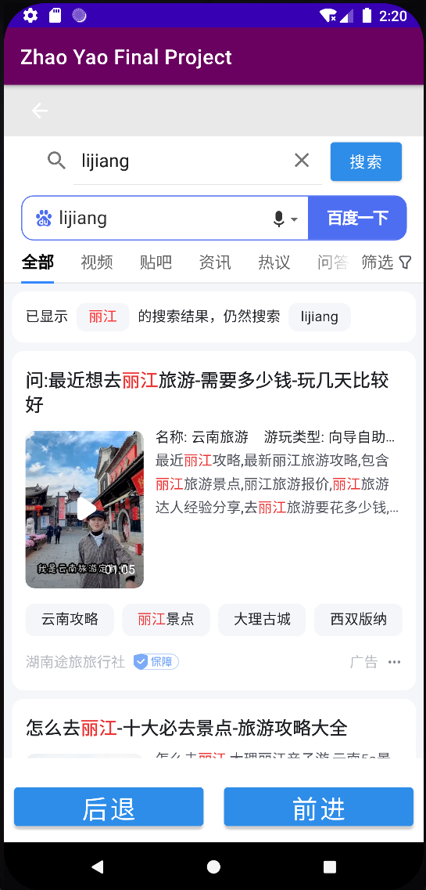
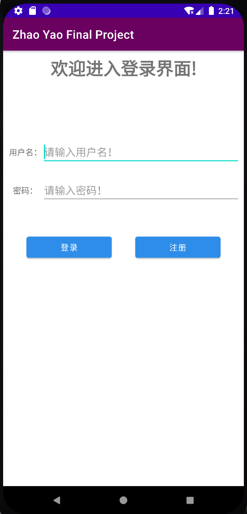
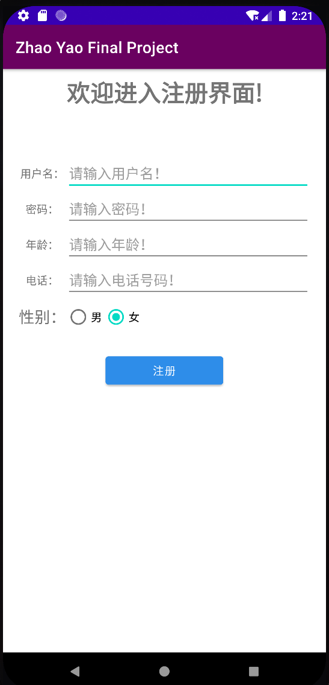
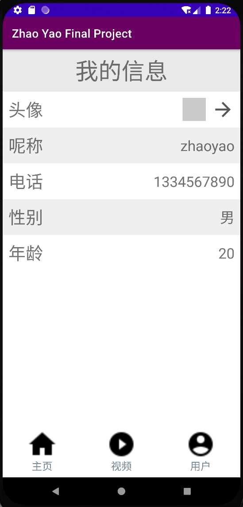

# MyProject

> Updated Date: 2023/7/31
> 
> Author: Zhao Yao 赵耀
> 
> 建议使用[typora](https://typora.io/)查看该文档

该项目是2023年暑期百度移动端训练营的大作业项目，开发了一个简单的安卓应用。
apk位置: apk/app-debug.apk

## 1. Android基本组件介绍

在本项目中，我使用Java语言在Android Studio开发一个类似于“百度”手机App的应用。在Android开发中，有许多基本组件，其中一些常见的如下：

### Activity：
Activity是Android应用中一个重要的组件，它代表了一个用户界面和用户交互的单个屏幕。每个Activity都有一个布局，其中包含了用户所看到的界面元素。

### Fragment：
Fragment是一种可以嵌入到Activity中的组件，它可以让应用界面更加灵活和模块化。通过使用Fragment，我们可以实现在不同设备屏幕大小和方向下的自适应布局。

### WebView：
WebView是用于在应用内显示网页内容的组件。它允许我们加载和显示网页，从而在应用中展示Web内容，如显示百度搜索结果页面。

### ImageView：
ImageView是用于显示图片的组件。它可以用于展示百度应用的Logo、搜索结果中的图片等。

### TextView：
TextView是用于显示文本内容的组件。它用于显示搜索结果的文本信息、搜索关键词等。

## 2. 代码模块化设计（MVVM架构）

在本项目中，我采用了MVVM（Model-View-ViewModel）架构来进行代码模块化设计。MVVM是一种常见的软件架构模式，它将应用分为三个主要部分：

### Model：
Model代表应用的数据和业务逻辑。在我的应用中，Model负责处理搜索关键词、请求百度搜索结果数据等。

### View：
View是用户界面的部分，它展示数据给用户并接收用户的交互。在我的应用中，View包括Activity和Fragment，负责显示搜索结果、图片和文本内容等。

### ViewModel：
ViewModel是连接Model和View的桥梁。它负责从Model获取数据，并将数据处理后提供给View进行显示。在我的应用中，ViewModel处理搜索请求、数据转换和数据更新等。

通过采用MVVM架构，实现了代码的分离和模块化，使得应用的开发和维护更加简洁和高效。

## 3. 安卓应用开发的常见难点及解决方法

在Android应用开发中，常见的难点包括：

### 多设备适配：
不同设备的屏幕大小和分辨率差异，以及横竖屏切换可能导致界面显示问题。解决方法包括使用ConstraintLayout来实现灵活的布局，以及提供不同尺寸的资源文件。

### 内存管理：
Android设备资源有限，应用需要注意内存管理，避免内存泄漏和频繁GC。解决方法包括优化资源的使用，及时释放不需要的对象和资源。

### 异步处理：
在网络请求和耗时操作时，需要进行异步处理，以避免阻塞主线程导致应用无响应。解决方法包括使用AsyncTask、Handler、RxJava等进行异步处理。

### 安全性：
保护用户数据和隐私是重要的任务。解决方法包括使用HTTPS加密传输数据，避免硬编码敏感信息，以及使用Android权限系统来保护用户隐私。

通过仔细考虑和应用这些解决方法，我能够克服安卓应用开发中的常见难点，确保应用的稳定性和用户体验。

## 4. UI截图

|  |  |  |
| ------------------------------------------------------------ | ------------------------------------------------------------ | ------------------------------------------------------------ |
|  |  |  |
|  |  |  |

## 5. 项目感受

我很高兴能够参加百度安卓移动端开发夏令营，这段时间的学习和体验非常有意义。以下是我在夏令营中的学习体验、上课体验和做项目的感受：

学习体验：
在夏令营期间，我得到了系统而全面的安卓移动端开发知识。课程内容涵盖了Android基础组件、布局设计、UI界面开发、网络通信、数据库操作等。导师们用生动的案例和实际项目演示，使我对安卓开发有了更深入的了解。每天的学习时间安排紧凑但不拖沓，使我能够充分吸收知识。

上课体验：
百度的导师们都非常专业和耐心，教学内容深入浅出，容易理解。他们对学员的问题总是耐心解答，并且乐于分享实际项目开发经验。课堂氛围轻松而活跃，我也有机会和其他同学一起讨论问题，相互学习和进步。

做项目的感受：
在夏令营的最后阶段，进行了一个实际的Android项目开发。这个项目不仅让我应用之前学到的知识，还锻炼了我的知识检索能力和问题解决能力。虽然时间紧迫，但导师们给予了我们足够的指导和支持。我们共同克服了各种技术挑战，成功完成了一个功能完整的应用，这成就感非常满足。

总的来说，参加百度安卓移动端开发夏令营是一次难忘的经历。我不仅学到了专业知识，还结交了志同道合的朋友。这段时间让我更加坚定了从事移动端开发的决心，同时也让我更加深刻地理解了团队合作和项目管理的重要性。我将珍视这段体验，并努力将所学知识应用到未来的项目中。感谢百度夏令营给予我的宝贵机会，我相信这次经历将在我未来的职业发展中产生积极的影响。

